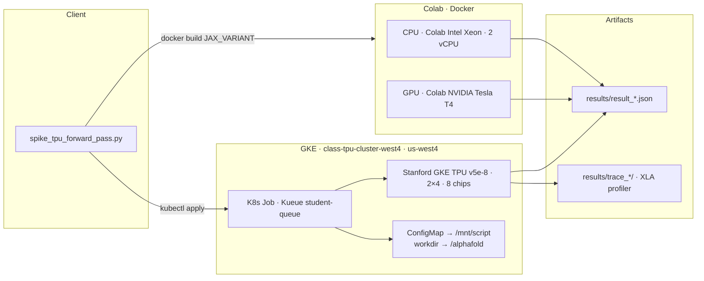
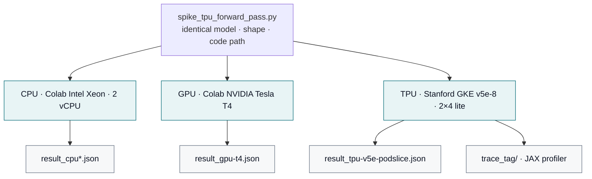

# AlphaFold TPU Benchmark: Executive Technical Report

**Stanford University** · Summer Session 2026, IHP  
**Course:** Introduction to High Performance Computing and AI Systems (ME344)  
**Pathway:** Option 2 - Custom Scientific ML Workload  
**Students:** Lorenzo Pazienza & Ihab El Bani  
**Professors:** Steve Jones, Mourad Bouache

**Live site:** [alphafold-tpu.vercel.app](https://alphafold-tpu.vercel.app) · **Repo:** [lorenzopazienza/alphafold-tpu-benchmark](https://github.com/lorenzopazienza/alphafold-tpu-benchmark) · **Slides:** [presentation PDF](presentation/AlphaFold_on_Google_TPUs_Pazienza_Lorenzo_Ihab_El_Bani.pdf) (also [download from the site](https://alphafold-tpu.vercel.app/presentation/AlphaFold_on_Google_TPUs_Pazienza_Lorenzo_Ihab_El_Bani.pdf))

---

## Executive Summary

**The problem.** Biology often needs a protein’s 3D shape; that structure drives function, disease, and drug discovery. Google DeepMind’s [AlphaFold 2](https://github.com/google-deepmind/alphafold) made high-accuracy prediction practical with a large JAX/Haiku network (attention-heavy Evoformer). Running that inference at useful scale is expensive and opaque across hardware: cold XLA compiles, underused multi-chip TPU pods, and unclear CPU vs GPU vs TPU cost/latency trade-offs.

**What we did.** We treated AlphaFold 2’s real forward pass as the system under test - **same model, same script, same input shape** on Colab Intel Xeon CPU (2 vCPU), Colab NVIDIA Tesla T4, and Stanford GKE TPU v5e-8 (tpu-v5-lite-podslice, 2×4, 8 chips) - then measured, profiled, and mitigated the bottlenecks. Systems question: **where does this workload spend time, and how does that change per backend?** As a follow-up (see [AlphaFold3 side-investigation](#alphafold3-side-investigation) below), we also brought up [AlphaFold 3](https://github.com/google-deepmind/alphafold3) - DeepMind's separate, newer, diffusion-based codebase, not a version of AlphaFold 2 - on the same CPU/GPU backends, with real measured performance and reproducibility results, plus a confirmed finding that AlphaFold 3's public release does not support TPU inference at all. Orchestration, telemetry, and comparisons in this repo are ours; the models themselves are DeepMind’s.

| Tooling matrix (course requirement: ≥3 stack elements) | Choice |
|---|---|
| **Compute targets** | Colab Intel Xeon CPU (2 vCPU) · Colab NVIDIA Tesla T4 · Stanford GKE TPU v5e-8 (2×4 lite) |
| **Orchestration** | Docker (multi-backend image) · Kubernetes Jobs on GKE + Kueue |
| **Compilation layer** | JAX/XLA (JIT, compile cache, `vmap` / `pmap`) |
| **Telemetry** | `jax.profiler` traces · TensorBoard Profile · in-process HBM / `tpu-info` |

**Headline result:** steady-state TPU inference is **451×** faster than CPU and **27.8×** faster than Colab NVIDIA Tesla T4 (0.47s vs 212s / 13s). Cold TPU calls are dominated by host-side XLA compilation (~76% in `pjit` `cache_miss`). Default single-query path uses **1 of 8 chips**; multi-query `jax.pmap` recovers **6.92×** throughput; ensemble `pmap`+`pmean` fills **8/8 chips** for one query’s averaging (GSPMD auto-mesh only replicated).


---

## Repository layout

```text
alphafold-tpu-benchmark/
├── configs/                   # Kubernetes Jobs (GKE + Kueue)
│   ├── af_spike_batch.yaml            # Batch-size sweep
│   ├── af_spike_chipcount.yaml        # Chip visibility
│   ├── af_spike_combined.yaml         # Models + repeats + cache
│   ├── af_spike_ensemble_shard.yaml   # Real single-query sharding (pmap + pmean)
│   ├── af_spike_job.yaml              # Baseline TPU run
│   ├── af_spike_job_sweep.yaml        # Length / recycle sweeps + tpu-info
│   ├── af_spike_precision.yaml        # float32 vs bfloat16
│   ├── af_spike_scaling_grid.yaml     # Chips × length grid
│   ├── af_spike_sharding.yaml         # pmap / shard experiments
│   ├── af_spike_trace_capture.yaml    # Profiler trace export window
│   └── af_spike_af3_tpu.yaml          # AlphaFold3 TPU attempt -- confirmed unsupported, kept as documentation
├── Dockerfile                 # Multi-backend image (JAX_VARIANT=cpu|cuda12|tpu)
├── figures/                   # Charts + structure stills for README / site
│   ├── batching_chart.png
│   ├── scaling_charts.png
│   ├── scaling_law_chart.png
│   ├── ubiquitin_confidence.png
│   └── ubiquitin_structure.png        # ESMFold pLDDT render (above)
├── notebooks/                 # Colab / Jupyter reproduction
│   ├── alphafold_cpu_benchmark.ipynb   # AF2 CPU (Colab Intel Xeon, 2 vCPU) -- run_tag=cpu-colab
│   ├── alphafold_gpu_benchmark.ipynb   # AF2 GPU (Colab NVIDIA Tesla T4) -- run_tag=gpu-t4
│   ├── real_protein_fold_visualization.ipynb
│   ├── af3_cpu_colab.ipynb            # AF3 CPU (Colab Intel Xeon, 2 vCPU) -- run_tag=cpu-colab
│   └── af3_gpu_colab.ipynb            # AF3 GPU (Colab NVIDIA Tesla T4) -- run_tag=gpu-t4
├── presentation/
│   └── AlphaFold_on_Google_TPUs_Pazienza_Lorenzo_Ihab_El_Bani.pdf  # Course deck (mirrored on the site)
├── profiling/
│   └── trace_analysis.md      # XLA cache_miss diagnosis (~76% cold path)
├── README.md                  # This executive report
├── results/                   # Measured outputs cited in this report
│   ├── comparison.md          # CPU / GPU / TPU table + analysis
│   ├── cost_analysis.md       # $/prediction economics
│   ├── result_cpu*.json
│   ├── result_gpu-t4.json
│   ├── result_tpu-v5e-podslice.json
│   ├── result_af3_cpu-colab.json      # AlphaFold3 CPU (Colab Intel Xeon, 2 vCPU) -- real, measured
│   ├── result_af3_gpu-t4.json         # AlphaFold3 GPU (Colab NVIDIA Tesla T4) -- real, measured
│   ├── sweep/                 # Scale + mitigation study (12 experiments) + AF3 side-investigation
│   │   ├── batching.md · chip_visibility.md · compilation_cache.md
│   │   ├── ensemble_shard.md · precision.md · README.md
│   │   ├── scaling_law.md · sharding.md · *.json
│   │   ├── af3_comparison.md          # AlphaFold2 vs AlphaFold3: full comparison, all 3 backends
│   │   ├── af3_tpu_attempt.log        # TPU attempt log -- confirmed unsupported by AF3's public CLI
│   │   ├── af3_toy_test_summary_confidences.json · af3_toy_test_ranking_scores.csv        # Stanford CPU
│   │   ├── af3_toy_test_cpu-colab_summary_confidences.json · af3_toy_test_cpu-colab_ranking_scores.csv  # Colab Intel Xeon CPU (2 vCPU)
│   │   ├── af3_toy_test_gpu-t4_summary_confidences.json · af3_toy_test_gpu-t4_ranking_scores.csv        # Colab NVIDIA Tesla T4
│   └── trace_<tag>/           # jax.profiler / TensorBoard traces
├── scripts/
│   ├── run_spike.sh            # gcloud creds · ConfigMap · kubectl apply (AF2)
│   └── run_af3_spike_tpu.sh    # Same, for AlphaFold3 on TPU (experimental)
├── src/                       # Benchmark entrypoints (same path, all backends)
│   ├── spike_batch_forward_pass.py          # jax.vmap multi-query batching
│   ├── spike_ensemble_shard_forward_pass.py # Real single-query sharding (pmap + pmean)
│   ├── spike_meshshard_forward_pass.py      # GSPMD auto-mesh attempt
│   ├── spike_pmap_forward_pass.py           # Multi-chip data parallel
│   ├── spike_tpu_forward_pass.py            # Baseline: init / cold / steady-state
│   └── make_af3_input.py                    # Shared AF3 input builder (Colab + TPU Job)
├── structure/
│   ├── ubiquitin_predicted.pdb        # Real fold for 3D exhibit
│   ├── af3_toy_test_model.cif                 # AF3, original Stanford CPU run
│   ├── af3_toy_test_cpu-colab_model.cif       # AF3, Colab Intel Xeon CPU (2 vCPU) run
│   └── af3_toy_test_gpu-t4_model.cif          # AF3, Colab NVIDIA Tesla T4 run (see af3_comparison.md Section 5b/6 for how this differs from the CPU one)
├── vercel.json                # Root Vercel build → website/
└── website/                   # Vite + React showcase → alphafold-tpu.vercel.app
    ├── public/figures/ · public/structure/ · public/presentation/
    ├── src/components/ · src/pages/
    └── src/data/experiments.js
```

---

## System Topology Diagram

Cluster layout, storage paths, and compute workers used for this study.

### 1. Cluster & storage layout



### 2. One script → three backends



| Item | Value |
|---|---|
| GCP project | `soe-hpccenter` |
| GKE cluster | `class-tpu-cluster-west4` |
| Region | `us-west4` |
| TPU accelerator | `tpu-v5-lite-podslice`, topology `2×4` (8 chips) |
| Orchestration | Kubernetes Job, admitted via Kueue (`student-queue`) |
| Script inject path | ConfigMap → `/mnt/script` → copied into `/alphafold` |
| Artifact paths | `results/result_*.json`, `results/trace_<tag>/`, `results/sweep/` |

We deliberately avoid two heavy dependencies that are not needed for the systems question:

1. **MSA search** (jackhmmer/hhblits) - replaced with a trivial single-sequence MSA via AlphaFold’s `pipeline.make_msa_features`.
2. **Trained parameters** (~350MB/model) - `RunModel` uses Haiku random init, exercising the same JIT graph shapes and accelerator ops as a real forward pass.

---

## Performance Delta Analysis

Identical workload: `model_3`, 0 recycles, 118-residue sequence, Haiku random-init params. Only the backend changes. Full per-run JSON lives under `results/`; narrative in [`results/comparison.md`](results/comparison.md).

### CPU / GPU / TPU baseline

| Backend | Devices | init_params (s) | 1st predict (compile+run) | Steady-state (s) | vs CPU |
|---|---|---|---|---|---|
| CPU (Colab Intel Xeon, 2 vCPU) | 1 | 41.99 | 271.98 | 212.113 | 1× |
| GPU (Colab NVIDIA Tesla T4) | 1 | 109.16 | 97.62 | 13.086 | **16.2×** |
| **TPU (Stanford GKE v5e-8, 2×4 lite)** | **8 chips** | **36.6** | **27.78** | **0.47** | **451×** |

| Metric | CPU Xeon | GPU Tesla T4 | TPU v5e-8 |
|---|---|---|---|
| Cold / warm ratio | 1.28× | 7.46× | **59.1×** |
| Steady-state vs GPU | - | 1× | **27.8×** |
| Cost / 1k predictions | $11.19 | $1.27 | $1.25 |

### Scale configurations (TPU sweep)

Twelve further experiments on the Stanford GKE TPU v5e-8 (2×4 lite) slice (`results/sweep/`):

| Configuration | Key delta |
|---|---|
| Sequence length 60 → 500 | Super-linear: **8.3×** length → **14.6×** steady-state time |
| Recycle depth 0 → 3 | Steady-state **~0.46s per extra recycle** (linear); compile jumps once then flat |
| Chip visibility 1 vs 8 | **No** single-query speedup - default path uses 1 chip |
| Precision float32 → bfloat16 | Steady-state HBM **−40%**; wall-clock ≈ unchanged at this size |
| `jax.vmap` batch 1/2/4/8 | Throughput **worse** as batch grew (single-chip only) |
| Compilation cache (warm restart) | **6.8×** faster `init_params`, **1.9×** faster first predict |
| `jax.pmap` 8 proteins / 8 chips | **6.92×** throughput (2.13 → 14.72 proteins/s) |
| GSPMD auto-mesh (1 protein) | **Replicated**, not sharded - 463MB on every chip, reproduced twice |
| Ensemble shard: `pmap` + `pmean` | Fixed the auto-mesh failure - **8/8 chips**, verified-correct cross-device reduction |
| Scaling law (16-point grid) | `throughput ≈ 4527.77 · chips^0.963 · length^−1.572` (R² **0.981**) |


---

## The Infrastructure Bottleneck Diagnosis

**Primary operational bottleneck (cold TPU path): host-side XLA compilation**, not device FLOPs.

Evidence from the captured profiler trace ([`profiling/trace_analysis.md`](profiling/trace_analysis.md)):

- First TPU `predict` ≈ **16.56s**; JAX `pjit.py` **`cache_miss`** alone ≈ **12.55s (~76%)**.
- Device track (`/device:TPU:0`) is nearly idle during that interval - cost is host JIT, not MXU saturation.
- Cold/warm ratio on TPU is **59.1×** (27.78s → 0.47s). CPU is only **1.28×** (compute-bound; little compile graph to amortize).

**Secondary bottleneck (baseline multi-chip utilization): 1-of-8 chip occupancy.**

- HBM activity stays on `TPU_0`; chips 1–7 ≈ 0 MB → ~**87%** of the paid pod idle for a single query.
- `jax.vmap` does **not** fix this - it vectorizes inside one chip and *reduced* proteins/sec as batch grew.
- List-price TPU vs T4 cost per 1k predictions therefore lands almost equal ($1.25 vs $1.27) despite a 28× wall-clock gap ([`results/cost_analysis.md`](results/cost_analysis.md)).

**Bottleneck shifts by backend:**

| Backend | Dominant cost | Signature |
|---|---|---|
| CPU | Tensor compute | Cold ≈ warm |
| GPU Tesla T4 | Mixed compute + compile | Cold/warm ~7× |
| TPU v5e-8 | XLA compile (cold); under-utilized slice (multi-query) | Cold/warm ~59×; 1/8 chips used |

---

## Engineering Mitigations

Architectural adjustments measured or recommended against the bottlenecks above:

| Mitigation | What we did | Outcome |
|---|---|---|
| **Persistent XLA compile cache** | `--cache_dir` / `jax_compilation_cache_dir` across process restart | **6.8×** faster `init_params`, **1.9×** first predict - primary fix for cold-path compile |
| **Multi-chip data parallel (`jax.pmap`)** | One independent protein per chip on the 8-chip slice | **6.92×** throughput - primary fix for 1-of-8 idle waste |
| **bfloat16 precision** | `--precision bfloat16` vs float32 | HBM **−40%**; little speed gain at 118 residues (still useful for larger sequences / packing) |
| **Batch size via `vmap`** | Batches 1/2/4/8 | **Negative** for this graph - do not treat as multi-chip scaling |
| **Recycle / length policy** | Swept recycles and lengths | Recycles scale linearly at runtime; length is super-linear (attention) - size SLOs accordingly |
| **GSPMD auto-mesh** | Course Tunix-style auto sharding of one protein | **Did not** shard tensors (full replica per chip) - root cause: AlphaFold's own ensembling is a sequential `hk.while_loop`, nothing for GSPMD to distribute |
| **Ensemble shard (`pmap` + `pmean`)** | Re-implemented AlphaFold's own ensemble-average as a `pmap`+collective reduction instead, zero changes to AlphaFold's source | **Fixed it** - 8/8 chips genuinely used, cross-device reduction verified correct |
| **Recommended ops practice** | Keep serving process warm; pad to shared shapes; choose chip count for latency/throughput SLO, not unit $/pred | Matches Lab 1/3 vLLM `VLLM_XLA_CACHE_PATH` lesson; cost/prediction ~flat in chip count after `pmap` |

---

## Reproduction

### Locally / CPU
```bash
docker build --build-arg JAX_VARIANT=cpu -t af-bench:cpu .
docker run -v $(pwd)/results:/alphafold/results af-bench:cpu --run_tag=cpu
```

### GPU (e.g. Google Colab, free T4)
```bash
docker build --build-arg JAX_VARIANT=cuda12 -t af-bench:gpu .
docker run --gpus all -v $(pwd)/results:/alphafold/results af-bench:gpu --run_tag=gpu-t4
```

### TPU (Stanford class cluster)
```bash
export TEAM=<your-team-name>
gcloud container clusters get-credentials class-tpu-cluster-west4 --region=us-west4 --project=soe-hpccenter
kubectl config use-context gke_soe-hpccenter_us-west4_class-tpu-cluster-west4

kubectl create configmap af-spike-script-${TEAM} --from-file=src/spike_tpu_forward_pass.py \
  --dry-run=client -o yaml | kubectl apply -f -
envsubst < configs/af_spike_job.yaml | kubectl apply -f -
kubectl logs -f job/af-spike-${TEAM}
```

*AlphaFold3 reproduction commands are in the [AlphaFold3 side-investigation](#alphafold3-side-investigation) section below, alongside its results.*

All three use the identical input (`src/make_af3_input.py`: same
118-residue toy sequence, empty MSA, seed=1) so the results drop straight
into `af3_comparison.md`'s Performance Comparison table once run.
Each run wraps the first `predict()` in `jax.profiler.trace(...)`, isolating **XLA compilation** from **steady-state execution** (second uncompiled `predict()`). View with:

```bash
pip install tensorboard-plugin-profile
tensorboard --logdir=results/trace_<tag>
```

---

## Real protein structure (beyond the systems benchmark)

Systems timings use random-init weights (valid for compile/execution study). [`structure/`](structure/) holds a **real** fold for exhibition:

- **Protein:** human ubiquitin (76 residues)
- **Model:** ESMFold (Meta AI), trained weights
- **Confidence:** mean pLDDT **90.5/100**
- Notebook: `notebooks/real_protein_fold_visualization.ipynb`


---

## AlphaFold3 side-investigation

DeepMind's newer, separate, diffusion-based
[AlphaFold3](https://github.com/google-deepmind/alphafold3) codebase
(distinct from AlphaFold2, the system under test everywhere else in this
report) was run on the same 118-residue toy sequence across all three
backends this project tests AF2 on: **CPU (Colab Intel Xeon, 2 vCPU), GPU (Colab NVIDIA Tesla T4), and
TPU (Stanford)**.

**CPU and GPU: real, measured results.** On identical Colab hardware, AF3
is **2.3x slower than AF2 per prediction on CPU, narrowing to 1.74x on
GPU** - AF3 gains proportionally more from the GPU (21.5x CPU→GPU
speedup vs. AF2's 16.2x). A same-seed reproducibility check across three
hardware/backend combinations found near-identical output across
different machines on the *same* backend (Stanford vs. Colab Intel Xeon CPU (2 vCPU), <0.1%
difference on 4/5 samples), but substantially different output *across*
backends (CPU vs. GPU differs by up to 32% per sample) - plausibly
explained by a numerical issue AlphaFold3's own issue tracker documents
for GPUs below compute capability 8.0 (the Colab T4 is 7.5).

**TPU: a confirmed, documented negative result.** Every infrastructure
step succeeded (native C++ build, Chemical Component Dictionary,
weights, `jax[tpu]` install) - the wall was AlphaFold3's own CLI:
`--jax_backend`'s valid values are `cpu`/`gpu`/`mps` only, no `tpu`
option exists. This matches AlphaFold3's official documentation, which
requires an NVIDIA GPU (compute capability ≥7.0) or CPU.

Full analysis, all tables, and the full TPU attempt log:
[`results/sweep/af3_comparison.md`](results/sweep/af3_comparison.md).

**Reproduction:**

```bash
# CPU: open notebooks/af3_cpu_colab.ipynb in Colab
#      Runtime -> Change runtime type -> CPU, then Run all

# GPU: open notebooks/af3_gpu_colab.ipynb in Colab
#      Runtime -> Change runtime type -> T4 GPU, then Run all
```

TPU is **not reproducible** - `configs/af_spike_af3_tpu.yaml` /
`scripts/run_af3_spike_tpu.sh` are kept as documentation of the confirmed
negative result above, not as a working path; running them reproduces
the same flag-validation failure logged in
[`results/sweep/af3_tpu_attempt.log`](results/sweep/af3_tpu_attempt.log).

---


## Project website

Vite + React site in [`website/`](website/).

```bash
cd website && npm install && npm run dev
```
