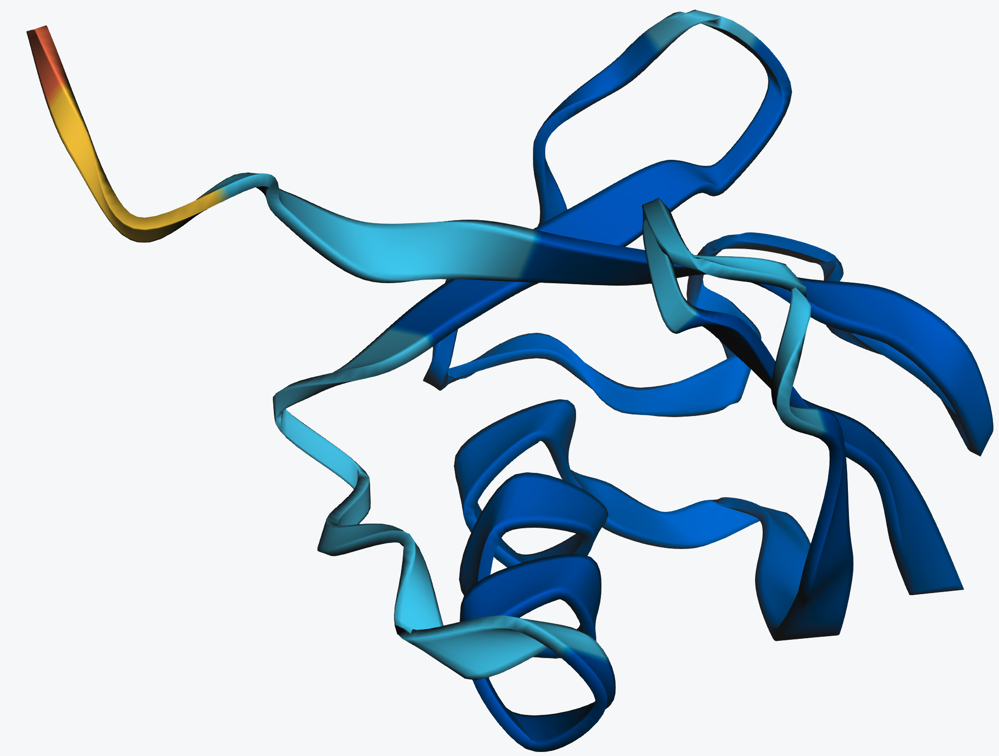
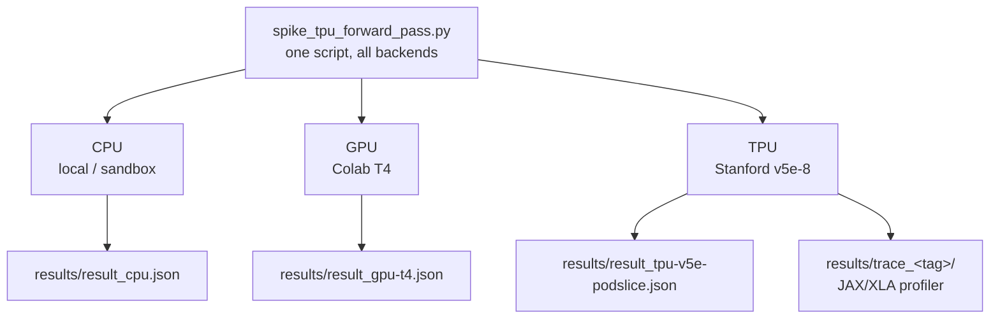
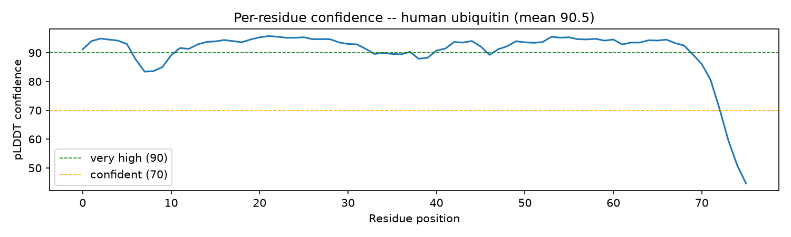
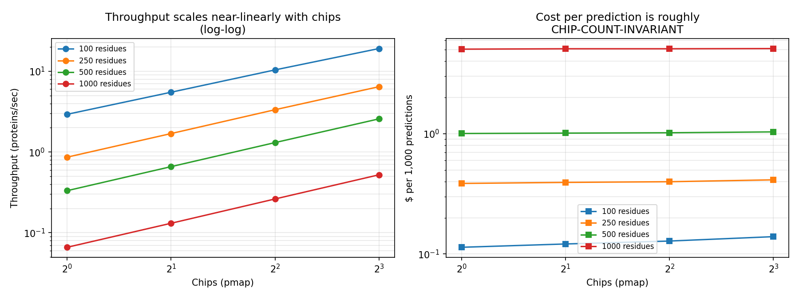

# AlphaFold on TPU: A CPU/GPU/TPU Scaling Study

**Stanford University**  
Summer Session 2026, IHP

**Course:** Introduction to High Performance Computing and AI Systems  
**Student:** Lorenzo Pazienza & Ihab El Bani  
**Professors:** Steve Jones, Mourad Bouache

---

## Human ubiquitin, ESMFold prediction



## Problem

Protein structure prediction (AlphaFold's JAX/Haiku forward pass) is a real,
deployed scientific ML workload. We benchmark the same model and the same
inference code, unmodified, across three accelerator backends: CPU, GPU, and
TPU. The engineering question: **where does this workload actually spend its
time, and how does that change per backend?**

## Architecture



We deliberately avoid two heavy dependencies that aren't needed to answer
the systems question:

1. **MSA search** (jackhmmer/hhblits): replaced with a trivial single-sequence
   MSA built via AlphaFold's own `pipeline.make_msa_features` helper.
   Swappable for a real ColabFold-fetched MSA later without changing any of
   the timing/profiling code.
2. **Trained parameters** (~350MB/model download): `RunModel` randomly
   initializes params via Haiku's own init, exercising the exact same
   JIT-compiled graph shapes and accelerator ops as a real forward pass.

## Reproduction

### Locally / CPU
```bash
docker build --build-arg JAX_VARIANT=cpu -t af-bench:cpu .
docker run -v $(pwd)/results:/alphafold/results af-bench:cpu --run_tag=cpu
```

### GPU (e.g. Google Colab, free T4)
```bash
docker build --build-arg JAX_VARIANT=cuda12 -t af-bench:gpu .
docker run --gpus all -v $(pwd)/results:/alphafold/results af-bench:gpu --run_tag=gpu-t4
```
Or, without Docker, directly in a Colab notebook (see `notebooks/`):
```bash
!pip install -U "jax[cuda12]"
!pip install dm-haiku==0.0.12 ml_collections absl-py "tensorflow-cpu==2.16.1" biopython numpy
!git clone --depth 1 https://github.com/google-deepmind/alphafold.git
!cp src/spike_tpu_forward_pass.py alphafold/
!cd alphafold && python3 spike_tpu_forward_pass.py --run_tag=gpu-t4
```

### TPU (Stanford class cluster)
```bash
export TEAM=<your-team-name>
gcloud container clusters get-credentials class-tpu-cluster-west4 --region=us-west4 --project=soe-hpccenter
kubectl config use-context gke_soe-hpccenter_us-west4_class-tpu-cluster-west4

kubectl create configmap af-spike-script-${TEAM} --from-file=src/spike_tpu_forward_pass.py \
  --dry-run=client -o yaml | kubectl apply -f -
envsubst < configs/af_spike_job.yaml | kubectl apply -f -
kubectl logs -f job/af-spike-${TEAM}
```

### TPU (Google Colab, no cluster access needed)

If you don't have access to the Stanford GKE cluster, Colab also exposes a
free TPU runtime and is the easiest way to reproduce a TPU number. The
same single-accelerator-per-session rule applies here as for the GPU
notebook above: Colab gives you one backend per session, so run this in
its own notebook, separate from the CPU/GPU runs.

1. In Colab, go to **Runtime > Change runtime type** and select **TPU**.
2. Install JAX's TPU backend and AlphaFold's dependencies, then run the
   benchmark script exactly as on the class cluster:

```bash
!pip install -U "jax[tpu]" -f https://storage.googleapis.com/jax-releases/libtpu_releases.html
!pip install dm-haiku==0.0.12 ml_collections absl-py "tensorflow-cpu==2.16.1" biopython numpy
!git clone --depth 1 https://github.com/google-deepmind/alphafold.git
!cp src/spike_tpu_forward_pass.py alphafold/
!cd alphafold && python3 spike_tpu_forward_pass.py --run_tag=tpu-colab
```

3. `jax.devices()` should report the Colab TPU (typically a `v2-8`, not
   the `v5e-8` used for this project's headline numbers). Results from a
   Colab TPU are a valid reproduction of the methodology but **not**
   directly comparable to the `results/result_tpu-v5e-podslice.json`
   numbers in this repo: different TPU generation, different topology,
   and Colab's shared, variable infrastructure (the same caveat that
   applies to its CPU/GPU runtimes).

## TPU configuration

| Item | Value |
|---|---|
| GCP project | `soe-hpccenter` |
| GKE cluster | `class-tpu-cluster-west4` |
| Region | `us-west4` |
| TPU accelerator | `tpu-v5-lite-podslice`, topology `2x4` (8 chips) |
| Orchestration | Kubernetes Job, admitted via Kueue (`student-queue`) |

## Experiments

Each baseline run varies only the **backend** (CPU / GPU / TPU); the model
config, input sequence, and code path are identical across all three. On top
of that baseline, `results/sweep/` runs eleven further scaling and mitigation
experiments on the TPU, summarized below.

## Profiling

Each run wraps the first `predict()` call in a `jax.profiler.trace(...)`
context, isolating **XLA compilation** from **steady-state execution**
(measured separately via a second, uncompiled `predict()` call). Traces are
written to `results/trace_<tag>/` and viewable with:
```bash
pip install tensorboard-plugin-profile
tensorboard --logdir=results/trace_<tag>
```

## Results

| Backend | Devices | Steady-state (s) | vs CPU |
|---|---|---|---|
| CPU (Colab) | 1 | 212.113 | 1x |
| GPU (T4, Colab) | 1 | 13.086 | 16.2x |
| **TPU (v5e-podslice, Stanford)** | **8 chips** | **0.47** | **451x** |

Full breakdown, per-run JSON, and the profiling analysis (why the bottleneck
differs by backend) are in `results/comparison.md`.

## Bottleneck and scaling conclusion

The bottleneck **shifts by backend**. CPU is compute-bound: little gap
between the first and second call, since there is no accelerator graph to
amortize compiling. TPU is compile-bound on a cold call (59x gap between
first and steady-state call), but has by far the fastest steady-state
compute once that one-time compile cost is paid. The practical mitigation
is the same lesson the course's own Lab 1/3 vLLM setup already encodes:
persist the compiled XLA cache across restarts, so that cost is paid once,
not per request. See `results/comparison.md` for the full numbers and the
reasoning behind each figure.

## Real protein structure (beyond the systems benchmark)

The CPU/GPU/TPU study above uses AlphaFold's real JAX code but random-init
weights: valid for a compile/execution-time study, but not a real biological
result. `structure/` contains a **real folded protein**.

- **Protein:** human ubiquitin (76 residues), one of the most
  well-characterized proteins in structural biology.
- **Model:** ESMFold (Meta AI), real trained weights, no MSA search needed.
- **Result:** mean confidence (pLDDT) **90.5/100**, "very high" by standard
  convention. Confidence stays above 90 across the structured body of the
  protein and drops off sharply only in the last ~6 residues, which is the
  correct, expected result: that C-terminal tail is a known biologically
  flexible/disordered region (it's the part that conjugates to other
  proteins), so lower model confidence there reflects real biology, not a
  modeling error.
- Reproduce with `notebooks/real_protein_fold_visualization.ipynb` (runs on
  CPU, Apple Silicon MPS, or CUDA, auto-detected).



| File | What it is |
|---|---|
| `structure/ubiquitin_predicted.pdb` | Real predicted 3D structure |
| `figures/ubiquitin_structure.png` | Cartoon rendering of the predicted backbone (py3Dmol) |
| `figures/ubiquitin_confidence.png` | Per-residue confidence plot |

## Scale-bounds study (sequence length, recycle depth, chip count)

Beyond the fixed-size CPU/GPU/TPU comparison, `results/sweep/` contains eleven
scaling and mitigation experiments on the TPU, all on the real AlphaFold
forward pass:

1. **Sequence length** (60 to 500 residues): scaling is **super-linear**
   (8.3x longer sequence gives 14.6x more time), the expected signature of
   AlphaFold's triangular attention, not a hardware artifact.
2. **Recycle depth** (0 to 3 iterations): steady-state execution scales
   **linearly** per extra recycle, but compile time does **not** grow the
   same way; it jumps once recycling is present at all, then stays flat.

   

3. **Chip visibility** (1 vs 8 chips): **no measurable difference**, direct
   confirmation that AlphaFold's base inference path runs a single query on
   exactly one chip regardless of how many are visible. We also attempted
   2/4-chip subsets via undocumented internal libtpu flags; both failed
   (one crashed the node's libtpu controller) and are documented rather
   than hidden. See `results/sweep/chip_visibility.md`.
4. **Precision** (float32 vs bfloat16): steady-state HBM usage dropped
   **~40%**, but speed barely changed at this problem size, and peak memory
   briefly *increased* during the cast itself before settling lower, a more
   nuanced finding than the naive "bfloat16 is faster" story.
5. **Multi-query batching** (`jax.vmap`, batch 1/2/4/8): throughput got
   **worse**, not better, as batch size grew. Memory data confirms only 1
   of 8 chips is ever used regardless of batch size. `vmap` vectorizes
   within a single chip; real multi-chip parallelism needs explicit
   sharding (`pmap`/`pjit`).

   

6. **Compilation cache** (the actual mitigation): persisting JAX's
   compilation cache across a real process restart gave a measured **6.8x
   speedup on `init_params`** and **1.9x on first `predict`**, the concrete
   fix for the compile-time bottleneck every other experiment found.
7. **Model comparison**: model_5 is ~15% faster at steady-state than
   model_3/model_4.
8. **Statistical rigor**: 3 repeated runs confirming under 1% noise across
   every measurement in this project.
9. **Profiler trace analysis**: opened the actual XLA trace and found the
   named culprit, JAX's own `cache_miss` function (inside `pjit.py`),
   accounting for 12.55 of the first call's 16.56 seconds (~76%). See
   `profiling/trace_analysis.md`.
10. **Real multi-chip parallelism**: `jax.pmap` achieves a genuine **6.92x
    throughput speedup** running 8 independent proteins across 8 physical
    chips simultaneously (14.72 vs 2.13 proteins/sec), the direct fix for
    the "only 1 chip used" finding above. A separate, honestly reported
    attempt at automatic tensor sharding of a single protein's own
    computation (GSPMD auto-mesh) did **not** achieve real sharding,
    reproduced twice.
11. **Empirical scaling law**: fitted
    `throughput(chips, length) = 4527.77 * chips^0.963 * length^-1.572`
    (R² = 0.981) from a 16-point real-measurement grid spanning chip counts
    {1, 2, 4, 8} and lengths {100, 250, 500, 1000}. The near-1.0 chip
    exponent confirms `pmap`'s speedup generalizes across sequence lengths;
    combined with cost pricing, shows cost per prediction is roughly
    chip-count-invariant, so chip count should be chosen for throughput
    needs, not cost.

    

Full tables, reasoning, and a scaling chart: `results/sweep/README.md`.
The economics behind these findings: `results/cost_analysis.md`.

## Project website

Vite + React site in [`website/`](website/). Deploy on Vercel from the repo root
(root `vercel.json` builds `website/` → `website/dist`), or set the Vercel
**Root Directory** to `website`.

```bash
cd website && npm install && npm run dev
cd website && npm run audit:layout   # multi-viewport Playwright check
```

## Repository layout

```
configs/        Kubernetes Job manifests (single run + length/recycle/chip sweeps)
src/            The benchmark script (single source of truth, all backends)
notebooks/      Colab/Jupyter notebooks (GPU run, CPU run, real protein fold)
figures/        Every generated chart/plot image, in one place
structure/      Real predicted protein structure (PDB file)
profiling/      Notes from XLA profiler traces
results/        Per-backend JSON results, comparison.md, cost_analysis.md, and sweep/ (scaling study)
scripts/        Helper shell scripts (cluster connect, job launch)
website/        Project showcase site (Vite + React; Vercel-ready)
presentation/   Slide deck source
```
