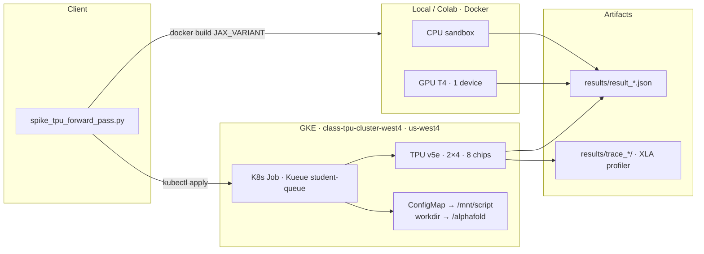
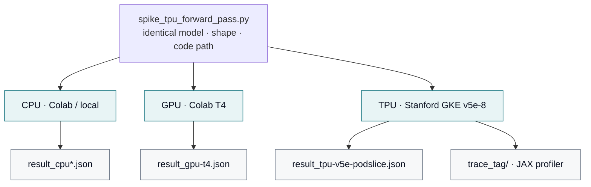

# AlphaFold TPU Benchmark: Executive Technical Report

**Stanford University** · Summer Session 2026, IHP  
**Course:** Introduction to High Performance Computing and AI Systems (ME344)  
**Pathway:** Option 2 — Custom Scientific ML Workload  
**Students:** Lorenzo Pazienza & Ihab El Bani  
**Professors:** Steve Jones, Mourad Bouache

**Live site:** [alphafold-tpu.vercel.app](https://alphafold-tpu.vercel.app) · **Repo:** [lorenzopazienza/alphafold-tpu-benchmark](https://github.com/lorenzopazienza/alphafold-tpu-benchmark)

---

## Executive Summary

Protein structure prediction (AlphaFold’s JAX/Haiku forward pass) is a deployed scientific ML workload. We ran the **same model, same script, and same input shape** across three accelerator backends—CPU, NVIDIA GPU (T4), and Google Cloud TPU v5e—to answer a systems question: **where does this workload spend time, and how does that change per backend?**

| Tooling matrix (course requirement: ≥3 stack elements) | Choice |
|---|---|
| **Compute targets** | Colab CPU · Colab NVIDIA T4 · Stanford GKE TPU v5e-8 (`2×4`) |
| **Orchestration** | Docker (multi-backend image) · Kubernetes Jobs on GKE + Kueue |
| **Compilation layer** | JAX/XLA (JIT, compile cache, `vmap` / `pmap`) |
| **Telemetry** | `jax.profiler` traces · TensorBoard Profile · in-process HBM / `tpu-info` |

**Headline result:** steady-state TPU inference is **451×** faster than CPU and **27.8×** faster than a T4 GPU (0.47s vs 212s / 13s). Cold TPU calls are dominated by host-side XLA compilation (~76% in `pjit` `cache_miss`). Default single-query path uses **1 of 8 chips**; `jax.pmap` recovers **6.92×** multi-query throughput across the full slice.


---

## System Topology Diagram

Cluster layout, storage paths, and compute workers used for this study.

### 1. Cluster & storage layout



### 2. One script → three backends



| Item | Value |
|---|---|
| GCP project | `soe-hpccenter` |
| GKE cluster | `class-tpu-cluster-west4` |
| Region | `us-west4` |
| TPU accelerator | `tpu-v5-lite-podslice`, topology `2×4` (8 chips) |
| Orchestration | Kubernetes Job, admitted via Kueue (`student-queue`) |
| Script inject path | ConfigMap → `/mnt/script` → copied into `/alphafold` |
| Artifact paths | `results/result_*.json`, `results/trace_<tag>/`, `results/sweep/` |

We deliberately avoid two heavy dependencies that are not needed for the systems question:

1. **MSA search** (jackhmmer/hhblits) — replaced with a trivial single-sequence MSA via AlphaFold’s `pipeline.make_msa_features`.
2. **Trained parameters** (~350MB/model) — `RunModel` uses Haiku random init, exercising the same JIT graph shapes and accelerator ops as a real forward pass.

---

## Performance Delta Analysis

Identical workload: `model_3`, 0 recycles, 118-residue sequence, Haiku random-init params. Only the backend changes. Full per-run JSON lives under `results/`; narrative in [`results/comparison.md`](results/comparison.md).

### CPU / GPU / TPU baseline

| Backend | Devices | init_params (s) | 1st predict (compile+run) | Steady-state (s) | vs CPU |
|---|---|---|---|---|---|
| CPU (Colab) | 1 | 41.99 | 271.98 | 212.113 | 1× |
| GPU (T4, Colab) | 1 | 109.16 | 97.62 | 13.086 | **16.2×** |
| **TPU (v5e-podslice, Stanford)** | **8 chips** | **36.6** | **27.78** | **0.47** | **451×** |

| Metric | CPU | GPU T4 | TPU v5e |
|---|---|---|---|
| Cold / warm ratio | 1.28× | 7.46× | **59.1×** |
| Steady-state vs GPU | — | 1× | **27.8×** |
| Cost / 1k predictions | $11.19 | $1.27 | $1.25 |

### Scale configurations (TPU sweep)

Eleven further experiments on the class TPU slice (`results/sweep/`):

| Configuration | Key delta |
|---|---|
| Sequence length 60 → 500 | Super-linear: **8.3×** length → **14.6×** steady-state time |
| Recycle depth 0 → 3 | Steady-state **~0.46s per extra recycle** (linear); compile jumps once then flat |
| Chip visibility 1 vs 8 | **No** single-query speedup — default path uses 1 chip |
| Precision float32 → bfloat16 | Steady-state HBM **−40%**; wall-clock ≈ unchanged at this size |
| `jax.vmap` batch 1/2/4/8 | Throughput **worse** as batch grew (single-chip only) |
| Compilation cache (warm restart) | **6.8×** faster `init_params`, **1.9×** faster first predict |
| `jax.pmap` 8 proteins / 8 chips | **6.92×** throughput (2.13 → 14.72 proteins/s) |
| Scaling law (16-point grid) | `throughput ≈ 4527.77 · chips^0.963 · length^−1.572` (R² **0.981**) |


---

## The Infrastructure Bottleneck Diagnosis

**Primary operational bottleneck (cold TPU path): host-side XLA compilation**, not device FLOPs.

Evidence from the captured profiler trace ([`profiling/trace_analysis.md`](profiling/trace_analysis.md)):

- First TPU `predict` ≈ **16.56s**; JAX `pjit.py` **`cache_miss`** alone ≈ **12.55s (~76%)**.
- Device track (`/device:TPU:0`) is nearly idle during that interval — cost is host JIT, not MXU saturation.
- Cold/warm ratio on TPU is **59.1×** (27.78s → 0.47s). CPU is only **1.28×** (compute-bound; little compile graph to amortize).

**Secondary bottleneck (baseline multi-chip utilization): 1-of-8 chip occupancy.**

- HBM activity stays on `TPU_0`; chips 1–7 ≈ 0 MB → ~**87%** of the paid pod idle for a single query.
- `jax.vmap` does **not** fix this — it vectorizes inside one chip and *reduced* proteins/sec as batch grew.
- List-price TPU vs T4 cost per 1k predictions therefore lands almost equal ($1.25 vs $1.27) despite a 28× wall-clock gap ([`results/cost_analysis.md`](results/cost_analysis.md)).

**Bottleneck shifts by backend:**

| Backend | Dominant cost | Signature |
|---|---|---|
| CPU | Tensor compute | Cold ≈ warm |
| GPU T4 | Mixed compute + compile | Cold/warm ~7× |
| TPU v5e | XLA compile (cold); under-utilized slice (multi-query) | Cold/warm ~59×; 1/8 chips used |

---

## Engineering Mitigations

Architectural adjustments measured or recommended against the bottlenecks above:

| Mitigation | What we did | Outcome |
|---|---|---|
| **Persistent XLA compile cache** | `--cache_dir` / `jax_compilation_cache_dir` across process restart | **6.8×** faster `init_params`, **1.9×** first predict — primary fix for cold-path compile |
| **Multi-chip data parallel (`jax.pmap`)** | One independent protein per chip on the 8-chip slice | **6.92×** throughput — primary fix for 1-of-8 idle waste |
| **bfloat16 precision** | `--precision bfloat16` vs float32 | HBM **−40%**; little speed gain at 118 residues (still useful for larger sequences / packing) |
| **Batch size via `vmap`** | Batches 1/2/4/8 | **Negative** for this graph — do not treat as multi-chip scaling |
| **Recycle / length policy** | Swept recycles and lengths | Recycles scale linearly at runtime; length is super-linear (attention) — size SLOs accordingly |
| **GSPMD auto-mesh** | Course Tunix-style auto sharding of one protein | **Did not** shard tensors (full replica per chip) — needs explicit sharding annotations |
| **Recommended ops practice** | Keep serving process warm; pad to shared shapes; choose chip count for latency/throughput SLO, not unit $/pred | Matches Lab 1/3 vLLM `VLLM_XLA_CACHE_PATH` lesson; cost/prediction ~flat in chip count after `pmap` |

---

## Reproduction

### Locally / CPU
```bash
docker build --build-arg JAX_VARIANT=cpu -t af-bench:cpu .
docker run -v $(pwd)/results:/alphafold/results af-bench:cpu --run_tag=cpu
```

### GPU (e.g. Google Colab, free T4)
```bash
docker build --build-arg JAX_VARIANT=cuda12 -t af-bench:gpu .
docker run --gpus all -v $(pwd)/results:/alphafold/results af-bench:gpu --run_tag=gpu-t4
```

### TPU (Stanford class cluster)
```bash
export TEAM=<your-team-name>
gcloud container clusters get-credentials class-tpu-cluster-west4 --region=us-west4 --project=soe-hpccenter
kubectl config use-context gke_soe-hpccenter_us-west4_class-tpu-cluster-west4

kubectl create configmap af-spike-script-${TEAM} --from-file=src/spike_tpu_forward_pass.py \
  --dry-run=client -o yaml | kubectl apply -f -
envsubst < configs/af_spike_job.yaml | kubectl apply -f -
kubectl logs -f job/af-spike-${TEAM}
```

### Profiling / telemetry
Each run wraps the first `predict()` in `jax.profiler.trace(...)`, isolating **XLA compilation** from **steady-state execution** (second uncompiled `predict()`). View with:

```bash
pip install tensorboard-plugin-profile
tensorboard --logdir=results/trace_<tag>
```

---

## Real protein structure (beyond the systems benchmark)

Systems timings use random-init weights (valid for compile/execution study). [`structure/`](structure/) holds a **real** fold for exhibition:

- **Protein:** human ubiquitin (76 residues)
- **Model:** ESMFold (Meta AI), trained weights
- **Confidence:** mean pLDDT **90.5/100**
- Notebook: `notebooks/real_protein_fold_visualization.ipynb`


---

## Project website

Vite + React site in [`website/`](website/).

```bash
cd website && npm install && npm run dev
```

---

## Repository layout

```
configs/        Kubernetes Job manifests (baseline + sweeps)
src/            Benchmark scripts (single source of truth)
notebooks/      Colab/Jupyter (GPU, CPU, real protein fold)
figures/        Charts and structure renders
structure/      Predicted PDB (ubiquitin)
profiling/      XLA profiler trace analysis
results/        Per-backend JSON, comparison.md, cost_analysis.md, sweep/
scripts/        Cluster connect / job helpers
website/        Showcase site (Vite + React; Vercel-ready)
```
