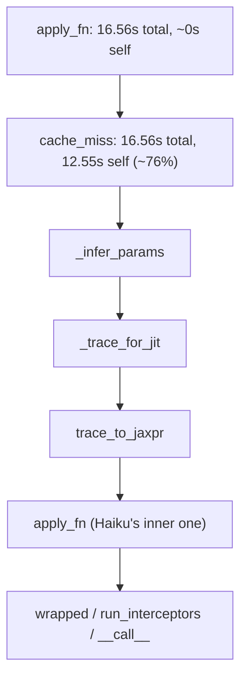

# XLA Profiler Trace Analysis

**Hardware:** Stanford GKE TPU v5e-8 (`tpu-v5-lite-podslice`, 2×4, 8 chips). Baseline CPU/GPU comparison: Google Colab Intel Xeon (2 vCPU) and Google Colab NVIDIA Tesla T4.

## Method

Every benchmark run wraps the first `predict()` call in
`jax.profiler.trace(...)`. For most runs the pod was cleaned up before the
trace was copied out (a real operational lesson: TPU pods disappear within
~1 minute of job completion). One dedicated run added an explicit
`sleep 180` window, letting us `kubectl cp` the trace directory off the pod
before it disappeared, then open it locally.

**Run analyzed:** model_3, 118 residues, recycle=0, float32
(`config: af_spike_trace_capture.yaml`)

**Tool:** Chrome's built-in trace viewer (`chrome://tracing`), loading the
`.trace.json.gz` file directly. TensorBoard's Profile plugin was tried
first but expects to connect to a *live* running TPU service rather than
open a saved trace file; the raw JSON viewer was the more direct route for
a file already captured from a since-terminated pod.

## Finding: the smoking gun

Clicking through the call stack under `pjrt-tpu-tasks` -> `spike_tpu_forwa`
down to the deepest frames, one specific named function stands out:

| Function | Wall Duration | Self Time | % of traced `apply_fn` call |
|---|---|---|---|
| `PjitFunction(apply_fn)` (outer wrapper) | 16.56s | 440 ns (~0%) | n/a |
| **`$pjit.py:250 cache_miss`** | 16.56s | **12.55s** | **~76%** |

`cache_miss` is a real, named function inside JAX's own `pjit.py` source
(not something we wrote), whose job is to trace and compile this function
because JAX hasn't seen this exact input shape/computation before. Its
**Self Time** (time spent directly in this function's own code, not its
children) is 12.55 out of the 16.56-second traced call: three quarters of the
traced `apply_fn` call is JAX's own JIT tracing/compilation machinery, not
TPU device execution.

## What sits inside cache_miss (the call stack)

Every frame in this chain is CPU-side Python/JAX bookkeeping, building and
lowering AlphaFold's Evoformer into XLA's intermediate representation. None
of it is TPU device time. The actual TPU device track (`/device:TPU:0`) in
the same trace shows only a handful of thin marks near the very start of
the timeline, confirming the chip itself is idle for nearly the entire
16.56 seconds, waiting on the host to finish tracing and compiling.

## Why this matters for the project's conclusion

This is the first-hand, function-level confirmation of what every other
experiment in `results/sweep/` inferred indirectly (via before/after
timing): **the bottleneck genuinely is JIT compilation overhead**, and
specifically it's concentrated in JAX's `cache_miss` tracing path, not in
TPU compute, not in data movement, not in the model's actual math.

This is also why the compilation cache experiment
(`results/sweep/compilation_cache.md`) targets the right cost, with an
important limit on how far the two results can be linked:

- The trace covers the first `predict()` call. The comparable cache
  measurement is therefore first `predict`, which drops from 28.80s (cold)
  to 15.19s (warm): **1.90x**, about 13.6s saved. The cache's larger
  **6.81x** speedup is on `init_params` (37.68s to 5.53s), a separate
  compilation that this trace does not cover, so it should not be compared
  with the 12.55s `cache_miss` figure.
- JAX's persistent cache stores compiled XLA binaries; a fresh process
  still re-traces the Python function to a jaxpr, which plausibly accounts
  for part of the 15.19s that remains on the warm first call.
- The trace and the cache experiment are separate runs. The traced
  `apply_fn` span (16.56s) is also shorter than the cold first `predict()`
  measured elsewhere (27.37s to 28.80s), and the trace does not explain that
  difference. The percentages above are relative to the 16.56s traced span,
  not to the full first-predict timing.

## Operational lesson learned along the way

TPU pods on this cluster get cleaned up within roughly a minute of job
completion. Capturing any file (traces, checkpoints, logs) that isn't
already streamed to `kubectl logs` requires an explicit `kubectl cp`
**while the pod is still alive**, either via a long `sleep` at the end of
the container command, or a background copy step triggered as soon as the
pod is `Running`.