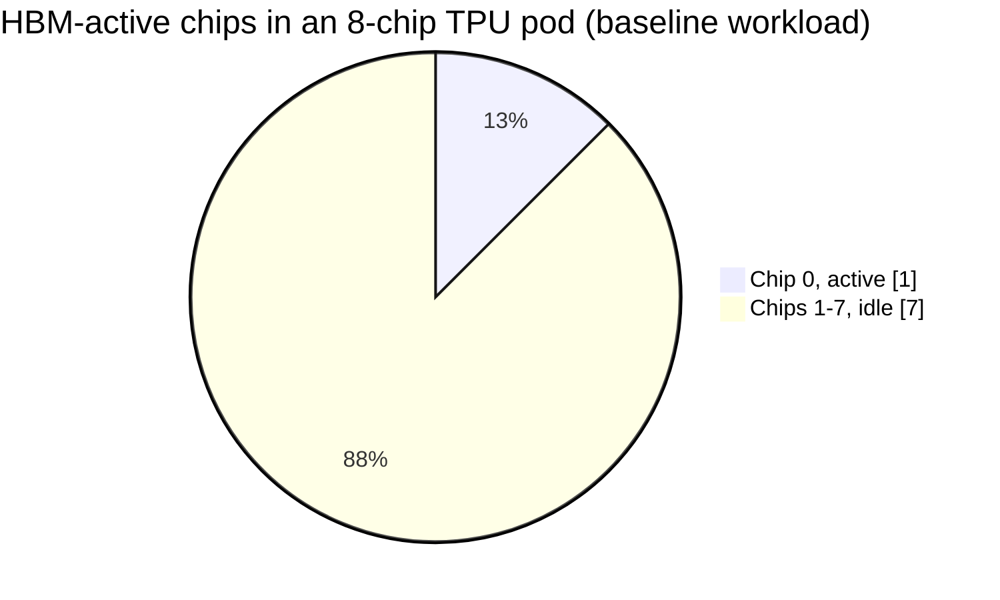

# Cost Analysis: What Does a Prediction Actually Cost?

## Pricing sources (verified live, August 2026)

- **TPU v5e**: $1.20/chip-hour on-demand (Google Cloud official pricing,
  `cloud.google.com/tpu/pricing`, us-central1/us-west1/us-west4-adjacent
  regions). Our cluster requests a full `2x4` (8-chip) topology, so the
  actual bill is **$9.60/hour for the whole pod**; there is no option to
  rent a smaller slice on this GKE Autopilot setup.
- **GPU T4**: ~$0.35/hour on-demand (current market rate, Google Cloud
  Compute Engine, per Thunder Compute's Aug 2026 GCP pricing survey).
- **CPU**: ~$0.19/hour (approx. n2-standard-4 on-demand).

## Cost per 1,000 predictions, using our measured steady-state times

| Backend | Predictions/hour | Cost basis | Cost per 1,000 predictions |
|---|---|---|---|
| CPU | 17.0 | $0.19/hr | $11.19 |
| GPU (T4) | 275 | $0.35/hr | $1.27 |
| **TPU (full 8-chip pod)** | **7,660** | **$9.60/hr** | **$1.25** |

## The finding that surprised us: TPU and GPU cost almost the same per prediction

Despite the TPU being **28x faster** in wall-clock time than the T4 (0.47s
vs 13.086s per prediction), the **cost per prediction is essentially
identical** ($1.25 vs $1.27 per 1,000), because the TPU pod costs 27x more
per hour than the single GPU, almost exactly canceling out its speed
advantage.

**This connects directly to the chip-visibility finding**
(`sweep/chip_visibility.md`): our baseline workload only ever uses 1 of the
pod's 8 chips, confirmed by the HBM memory data showing chips 1-7 at 0 MB
every time. We are paying for 8x the hardware we actually use.

**If cost were charged per chip actually used** (a hypothetical single-chip
rental at the same $1.20/chip-hour rate), TPU cost per prediction would
drop to **$0.157 per 1,000**, about **8x cheaper than the GPU**, matching
the raw speed advantage much more closely.

## Engineering recommendation

The economic lesson isn't "TPU is expensive," it's that **renting a full
8-chip pod for a workload that only shards across 1 chip wastes ~87% of
the money spent**. The two paths to actually capturing the TPU's real cost
advantage are exactly the ones this project's other experiments already
point to:

1. **Batch/shard properly across all 8 chips** (what `batching.md` showed
   `vmap` alone does NOT do; real multi-chip parallelism needs explicit
   `pjit`/mesh sharding or `pmap`, see `sweep/sharding.md`).
2. **Request a smaller topology** if the workload genuinely only needs one
   chip, where the platform/quota allows it.

Either fix would bring the TPU's cost-per-prediction close to its
speed-per-prediction advantage, rather than canceling it out. This is
exactly what happens once `pmap` is in play: `sweep/sharding.md` measures
a 6.92x throughput gain from using all 8 chips, and `sweep/scaling_law.md`
shows the resulting cost per prediction stays nearly flat as chip count
grows, so chip count becomes a throughput knob, not a cost penalty.
