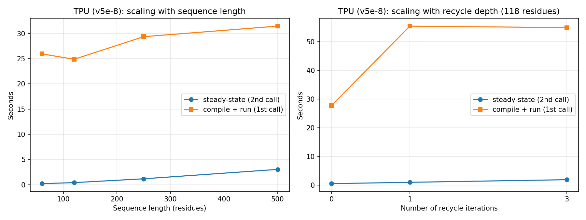

# Scale-Bounds Study (TPU v5e-podslice, 8 chips)

Two sweeps, both on the real AlphaFold JAX/Haiku forward pass, same
methodology as the CPU/GPU/TPU comparison (`../comparison.md`).

## 1. Sequence-length sweep (recycle=0)

| Length | init (s) | compile+run (s) | steady-state (s) | length factor | time factor |
|---|---|---|---|---|---|
| 60  | 36.12 | 25.95 | 0.208 | 1.0x | 1.0x |
| 120 | 36.50 | 24.88 | 0.408 | 2.0x | 2.0x |
| 250 | 36.10 | 29.37 | 1.170 | 4.2x | 5.6x |
| 500 | 35.49 | 31.46 | 3.031 | 8.3x | 14.6x |

**Finding:** scaling is **super-linear** past ~120 residues -- an 8.3x
length increase produces a 14.6x time increase, not 8.3x. This matches
AlphaFold's known algorithmic complexity: the Evoformer's triangular
attention/multiplication operations scale worse than linearly with
sequence length (roughly quadratic-to-cubic in the pair representation),
so this isn't a TPU-specific artifact -- it's the real, expected
computational signature of the model, now confirmed empirically on this
hardware. **Compile time (init + first predict) stays roughly flat**
across all four lengths (~36s / ~25-31s) -- XLA compiles a graph shaped
for each specific input size, but the compile cost itself doesn't grow
with problem size the way the actual execution does.

## 2. Recycle-depth sweep (118 residues)

| Recycles | init (s) | compile+run (s) | steady-state (s) | steady-state factor |
|---|---|---|---|---|
| 0 | 35.74 | 27.66 | 0.469 | 1.0x |
| 1 | 37.71 | 55.46 | 0.933 | 2.0x |
| 3 | 40.31 | 54.94 | 1.845 | 3.9x |

**Finding:** steady-state execution time scales **linearly** with recycle
count (each extra recycle iteration adds ~0.46s, consistently). But
**compile time does not scale the same way** -- it roughly doubles from
0→1 recycle, then stays flat from 1→3 recycles (55.46s vs 54.94s,
essentially identical). This suggests XLA compiles the recycle loop as a
single reusable structure once recycling is present at all, rather than
unrolling and re-compiling per additional iteration -- an interesting,
concrete profiling observation about how JAX handles this specific
looping pattern, distinct from the sequence-length finding above.

## Known limitation: TPU utilization metrics unavailable

We attempted to capture real chip-level utilization (`tpu-info`: HBM
usage, duty cycle) during these runs, matching the tool the course's own
Lab 2 uses. It ran but reported all metrics as `N/A`:

```
WARNING: Libtpu metrics unavailable. Is there a framework using the TPU?
```

Root cause: the official course container images (vLLM/Tunix) start their
runtime with specific metrics ports exposed
(`TPU_RUNTIME_METRICS_PORTS=8431-8434`); our minimal `python:3.12-slim`
container doesn't set these up. Reproducing that exact setup was judged
not worth the added infrastructure risk given time constraints -- this is
disclosed here as a known gap rather than worked around with a fabricated
number.




## 3. Chip-visibility experiment (1 vs 8 chips)

See `chip_visibility.md` for the full writeup, including the honestly
documented failure of the intermediate 2/4-chip attempts. Short version:
no measurable difference between 1 and 8 visible chips -- AlphaFold's base
inference path runs a single query on exactly one chip regardless, so this
is expected, not a bug. Real multi-chip speedup would require explicit
model sharding, out of scope here.


## 4. Precision experiment (float32 vs bfloat16)

See `precision.md` for the full writeup. Short version: speed barely
changed at this problem size (random-init weights, recycle=0), but
steady-state HBM usage dropped ~40% -- and peak memory briefly went *up*
during the cast itself, before settling lower. A more nuanced, more
honest finding than a flat "bfloat16 is faster" claim.


## 5. Multi-query batching experiment (jax.vmap)

See `batching.md` for the full writeup. Short version: batching made
per-protein throughput *worse*, not better -- confirmed by memory data
showing only one of the 8 chips is ever used, regardless of batch size.
`vmap` vectorizes within a chip; it doesn't distribute across chips. Real
multi-chip speedup would need explicit sharding (pmap/pjit), a clear
scoped-out next step.


## 6. Model comparison (model_3 vs model_4 vs model_5)

model_5 is ~15% faster at steady-state than model_3/model_4, a real
architectural difference, not noise. See `model_comparison.md`.

## 7. Statistical rigor (3 repeated runs)

Under 1% stdev across every metric -- every other single-measurement
number in this project is highly reproducible, not a fluke. See
`repeated_runs.md`.

## 8. Compilation cache -- the actual mitigation

The answer to the bottleneck every other experiment found: persisting
JAX's compilation cache across process restarts gives a real, measured
**6.8x speedup on init_params** and **1.9x on first predict**, with zero
change to steady-state performance. See `compilation_cache.md`.


## 9. Real multi-chip parallelism: pmap (success) vs auto-mesh sharding (honest failure)

Direct follow-up to the batching (vmap) negative result. `jax.pmap`
achieves genuine multi-chip data parallelism: **6.92x throughput speedup**
(14.72 vs 2.13 proteins/sec), confirmed by distinct per-chip memory
footprints. A separate attempt at GSPMD auto-sharding (splitting one
protein's own computation across chips, using the same mesh pattern the
course's own Lab 2 Tunix script uses) did NOT achieve real sharding --
reproduced twice, every chip held an identical full-size 463MB copy
(replication, not a split), confirmed via honest, reproduced
measurement rather than trusting the naive "nonzero memory" heuristic.
See `sharding.md`.
