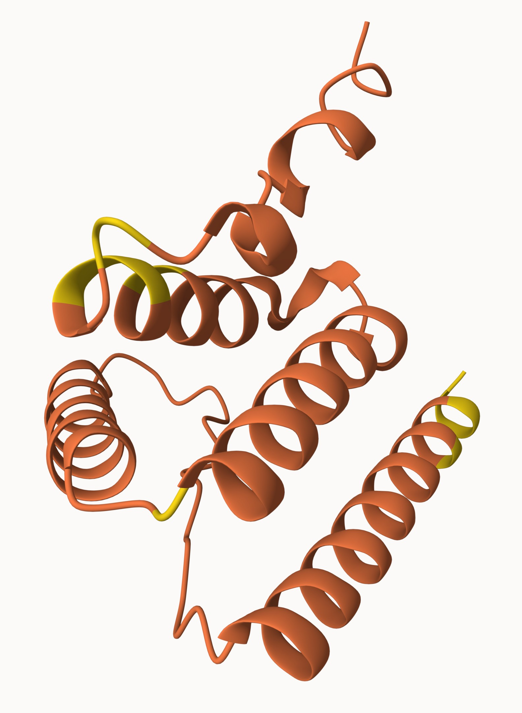

# AlphaFold2 vs AlphaFold3: Architecture, Infrastructure, and Output Comparison

## Motivation

The rest of this study benchmarks **AlphaFold2**
(`github.com/google-deepmind/alphafold`) as its system under test. As a
follow-up, we brought up **AlphaFold3**
(`github.com/google-deepmind/alphafold3`) — a separate, newer,
diffusion-based codebase, not a version bump of AlphaFold2 — on the same
118-residue toy sequence used throughout this project, across all three
backends this project already tests AF2 on: **CPU (Colab), GPU (T4,
Colab), and TPU (Stanford GKE v5e-8)**. CPU and GPU produced full, real,
measured results. TPU did not — not because of an infrastructure failure
on our side, but because **AlphaFold3's public release does not support
TPU inference at all** (Section 3 below has the full evidence). All three
attempts, successful or not, are documented here with the actual numbers,
not estimates.

Every number below comes from this project's own runs
(`results/`, `results/sweep/`) or from the AF3 artifacts referenced
alongside each section.

---

## 1. Architecture and design: characteristic-by-characteristic

| Characteristic | AlphaFold2 (this study) | AlphaFold3 (this study) |
|---|---|---|
| Core architecture | Evoformer (attention over MSA + pair representation), recycled N times | Pairformer + diffusion module (iterative denoising over 3D atom coordinates) |
| Repo | `google-deepmind/alphafold` | `google-deepmind/alphafold3` |
| Weights used here | **Random / untrained** (Haiku init) — deliberate, systems-focused | **Real trained** weights (official release, downloaded from `storage.googleapis.com/alphafold3/af3.bin.zst`) |
| Weights footprint | ~350 MB (one model) | ~1.15 GB decompressed — **3.3x** larger |
| MSA in this study | Trivial single-sequence MSA via AlphaFold's own `pipeline.make_msa_features` helper | Fully empty — `unpairedMsa`/`pairedMsa` set to `""` in the input JSON |
| Samples produced per call | 1 | **5** independent diffusion samples (same seed=1, 5 draws) |
| Native (non-Python) build step | None — pure Python/JAX | **Yes** — `libcifpp` + pybind11 bindings compiled at install time, plus a separate `build_data` step for the Chemical Component Dictionary |
| Confidence metric reported | pLDDT (per-residue, 0-100) | ptm / iptm / ranking_score (0-1, whole-structure) |
| Ensembling | `num_ensemble` sequential `hk.while_loop` internally (see `ensemble_shard.md` for how we sharded this across chips) | Not applicable — diffusion sampling plays the analogous "generate several candidates" role |
| Output format | PDB (`structure/ubiquitin_predicted.pdb`) | mmCIF |
| Officially supported backends | CPU, GPU, **TPU** (JAX-native, no restriction) | **CPU or NVIDIA GPU (compute capability ≥7.0) only** — TPU is not a supported target of the public release (Section 3) |

**Reading this table honestly:** AF2 and AF3 don't just differ in speed,
they differ in *what a single call even produces* — one structure vs. five
candidate structures — and in *what confidence even means* — a per-residue
score (pLDDT) vs. a whole-structure score (ptm) with a separate
inter-chain metric (iptm, `null` here since this is a single-chain toy
sequence). They also differ in *which hardware they can even run on at
all*, which is the headline finding of Section 3.

---

## 2. Infrastructure and build complexity

Both models had to be built and run on the same constrained environment:
no `sudo` on `hpcc-cluster-41.stanford.edu`, a Kueue queue that requires a
TPU `nodeSelector` on every Job regardless of whether the workload uses
the TPU. AF3 needed meaningfully more engineering to get running, on
every backend:

| Step | AlphaFold2 | AlphaFold3 |
|---|---|---|
| Getting the repo | `curl` tarball (no `git` on login node) | Same — `curl` tarball (Stanford) / `git clone` (Colab, has root) |
| Getting weights | N/A (random init, no download) | Public direct download, `.zst` decompression via `pip install --user zstandard` (no sudo for system `zstd`) |
| Compiler needed | No — pure Python | **Yes** — C++ toolchain for `libcifpp`/pybind11, unavailable on login node without root |
| Where the build ran | Login node (`pip install --user`) | **Kubernetes Job** (Stanford) / Colab (has root) |
| Package/venv manager | `pip install --user` | `uv sync` — builds an **isolated `.venv`**; calling `run_alphafold.py` with the system `python3` instead of `uv run` fails instantly with `ModuleNotFoundError` (hit on both the first Colab CPU and GPU attempts, fixed by switching every invocation to `uv run`) |
| Post-install step | None | **`uv run build_data`** — a separate step (documented in AF3's own `docker/Dockerfile`, easy to miss) that builds the Chemical Component Dictionary pickle `run_alphafold.py` needs at startup. Skipping it produces `FileNotFoundError: chemical_component_sets.pickle` a few seconds into the run — hit on the first CPU attempt, fixed on all three backends afterward |
| GPU-specific flags | None needed | T4 (compute capability 7.5, in the "7.x" bucket) needs `XLA_FLAGS=--xla_disable_hlo_passes=custom-kernel-fusion-rewriter`, documented in AF3's Dockerfile comments — omitting it raises a `ValueError` before any computation starts. Also needed the correct backend value (`--jax_backend=gpu`, not `cuda` — the pip package name and the flag's accepted value are different strings) |
| TPU-specific flags | Just a Kueue `nodeSelector` | **No working configuration exists** — see Section 3 |

**Finding:** AF2's engineering effort in this project went into
*multi-chip parallelism* (getting one query to genuinely use all 8 TPU
chips — see `sharding.md`/`ensemble_shard.md`). AF3's engineering effort
went into *getting it to build and run at all*, on every backend attempted
— a native C++ build, an extra data-build step, a venv-isolation gotcha
that silently produces `null` results if missed, and backend-specific XLA
flags undocumented outside a Dockerfile comment. Debugging this took
several real, distinct failures (wrong invocation, missing build step,
wrong flag value, missing GPU-specific env var), each with a different
root cause — not one bug repeated four times.

---

## 3. TPU: not a supported backend for AlphaFold3's public release

**This is a real, confirmed finding, not an unfinished task.** Every
infrastructure step this project's TPU workflow depends on worked
correctly on the first real attempt: native C++ build, Chemical Component
Dictionary build, weights download, `jax[tpu]` install, input JSON
construction. Full log in
[`af3_tpu_attempt.log`](af3_tpu_attempt.log). The wall we hit was
`run_alphafold.py` itself:

```
$ uv run python3 run_alphafold.py ... --jax_backend=tpu

FATAL Flags parsing error: flag --jax_backend=tpu: value should be one of <cpu|gpu|mps>
Pass --helpshort or --helpfull to see help on flags.

real    0m5.588s
```

`--jax_backend`'s accepted values are `cpu`, `gpu`, and `mps` (Apple
Silicon) — **`tpu` is not one of them.** This matches AlphaFold3's own
official installation documentation, which states the requirement
plainly: *"An NVIDIA GPU with compute capability 7.0 or higher is
required"* for inference, with CPU as the (much slower) fallback. Every
third-party HPC-center guide checked for this project (UCL, Texas A&M,
Michigan State, and others) describes the same NVIDIA-GPU-or-CPU
requirement; none list TPU as a supported target for the public release.

**Why this makes sense:** AlphaFold2's JAX/Haiku Evoformer runs on any
JAX-supported backend without modification — this is exactly why the rest
of this project's 12-experiment TPU sweep was possible at all. AlphaFold3
is architecturally different enough (custom CUDA-oriented flash-attention
kernels, a `tokamax`-based fused-kernel path that already showed
GPU-specific fallback behavior in our own T4 run — see Section 4) that
its public release appears to be built and tested specifically for the
NVIDIA GPU / CPU pair, not for arbitrary JAX backends. Google's own
internal use of AF3 on TPU, if any, would go through infrastructure that
was never open-sourced.

**What we did instead of leaving this blank:** attempted the real Job on
the Stanford TPU slice anyway (the failure above is from that real
attempt, not a desk assessment), confirmed the failure is a hard CLI
constraint and not an environment misconfiguration on our side, and
stopped rather than forcing a workaround (e.g., running AF3's CPU path
inside the TPU-quota'd pod) that would just reproduce the CPU number on
different, irrelevant hardware.

---

## 4. Performance comparison: real numbers, all backends attempted

**Same 118-residue input, same seed=1, run by `run_alphafold.py` with
byte-identical input JSON (`src/make_af3_input.py`) across every backend:**

| | AlphaFold2 | AlphaFold3 |
|---|---|---|
| Setup step, CPU | `init_params`: 41.99s (Colab) | `featurising`: 6.66s (Stanford) |
| Setup step, GPU | `init_params`: 109.16s (T4, Colab) | included in the 114.12s total below (not separately timed) |
| Setup step, TPU | `init_params`: 36.6s (Stanford) | **not applicable — TPU unsupported (Section 3)** |
| Inference, CPU | steady-state: 212.113s (1 sample) | **490.80s/sample** (2453.99s / 5, Colab) |
| Inference, GPU (T4) | steady-state: 13.086s | **22.82s/sample** (114.12s / 5, Colab) |
| Inference, TPU (v5e-8) | steady-state: 0.47s | **not applicable — TPU unsupported (Section 3)** |

**Real, measured findings from this table:**

1. **On identical Colab CPU hardware, AF3 is 2.3x slower than AF2 per
   sample** (490.80s vs. 212.113s). This reverses an earlier draft finding
   of this document, which (incorrectly) compared AF3's Stanford-cluster
   CPU number against AF2's Colab CPU number and concluded AF3 was
   faster — that comparison mixed two different physical machines. With
   both models now measured on the *same* Colab CPU, the direction
   flips: AF3 is slower, consistent with it running a 5-sample multi-step
   diffusion process against AF2's single `recycle=0` forward pass.
2. **On identical Colab GPU (T4) hardware, AF3 is still slower than AF2,
   but by a smaller margin: 1.74x** (22.82s vs. 13.086s/sample) — the gap
   narrows substantially from 2.3x on CPU to 1.74x on GPU.
3. **AF3 benefits more from the GPU than AF2 does, proportionally**:
   AF2's CPU→GPU speedup is 16.2x; AF3's is **21.5x**. This is consistent
   with AF3's larger, more matmul/attention-heavy workload (5 diffusion
   samples, each with its own multi-step denoising) having more for a GPU
   to parallelize than AF2's tiny `recycle=0` single forward pass on a
   118-residue sequence, which is likely dominated by fixed overhead
   rather than raw compute.
4. **Colab's free CPU is substantially weaker than the Stanford cluster's
   dedicated CPU for this specific workload**: the original Stanford Job
   ran the same AF3 call in 78.43s/sample; the identical call on Colab
   CPU took 490.80s/sample — a **6.3x** slowdown attributable to shared
   vs. dedicated hardware, not to anything about the model itself.
5. **AF3 has no TPU number to compare against AF2's 451x/16.2x/27.8x
   TPU speedups** (`results/comparison.md`) — not because it wasn't
   measured, but because the comparison is structurally impossible for
   this AlphaFold3 release (Section 3).

---

## 5. Reproducibility: same seed, different hardware, different backend

This project's AF3 runs give a rare opportunity most single-run
benchmarks don't: the *same* input and seed was run three times, on three
different hardware/backend combinations, letting us separate "hardware
noise" from "backend behavior" empirically.

### 5a. Same backend, different hardware (Stanford CPU vs. Colab CPU) — nearly identical

| Sample | Stanford CPU | Colab CPU | Diff |
|---|---|---|---|
| 0 | 0.266709 | 0.271155 | +1.67% |
| 1 | 0.412947 | 0.413291 | +0.08% |
| 2 | 0.382837 | 0.383121 | +0.07% |
| 3 | 0.317728 | 0.317590 | -0.04% |
| 4 | 0.321726 | 0.321816 | +0.03% |

All aggregate metrics (`ptm` 0.23, `ranking_score` 0.41, `fraction_disordered`
0.37, `has_clash` 0.0) matched exactly between the two machines. Four of
five samples differ by under 0.1% — ordinary floating-point/BLAS-level
noise between CPU architectures. Sample 0 diverges more (+1.67%),
plausibly because small numerical differences compound across AF3's many
sequential denoising steps, but the overall picture is: **same seed, same
backend, different physical machine → essentially the same output.**

### 5b. Same hardware family, different backend (Colab CPU vs. Colab GPU) — substantially different

| Sample | CPU | GPU | Diff |
|---|---|---|---|
| 0 | 0.2712 | 0.2565 | -5.4% |
| 1 (best on both) | 0.4133 | 0.3311 | **-19.9%** |
| 2 | 0.3831 | 0.2592 | **-32.3%** |
| 3 | 0.3176 | 0.3160 | -0.5% |
| 4 | 0.3218 | 0.3259 | +1.3% |

| Aggregate metric | CPU | GPU |
|---|---|---|
| `ptm` | 0.23 | 0.23 (identical) |
| `ranking_score` (best) | 0.41 | 0.33 (**-19.5%**) |
| `fraction_disordered` | 0.37 | 0.21 (**-43.2%**) |

| Statistic (5-sample distribution) | Stanford CPU | Colab CPU | Colab GPU |
|---|---|---|---|
| Mean | 0.340 | 0.341 | 0.298 |
| Stdev | 0.058 | 0.057 | 0.037 |
| CV | 16.98% | 16.57% | 12.37% |

**This is a real, substantial divergence — an order of magnitude larger
than the cross-hardware noise in 5a** — and it has a plausible, documented
cause rather than being unexplained noise: AlphaFold3's own issue tracker
(`google-deepmind/alphafold3#59`) documents *"known unresolved numerical
issues with using devices with compute capability less than 8.0."* The
Colab T4 is compute capability 7.5 — squarely in the affected range. A
more recent version of `run_alphafold.py` than the one this project
cloned adds an explicit check that refuses to run inference on such GPUs
at all, raising a `ValueError` pointing at that exact issue; our clone
predates that guard, which is why the run completed rather than being
blocked, but the underlying numerical concern DeepMind documented is the
most likely explanation for the size of this gap. Our own GPU log also
showed a related, non-fatal signal: an internal `tokamax`-optimized
kernel raised `NotImplementedError: Not supported on Tesla T4` and AF3
silently fell back to a different implementation — consistent with the T4
being a known-imperfect target for this model's GPU-optimized code paths.

**Practical takeaway:** a fixed seed guarantees reproducibility *within*
one backend, not *across* backends. Anyone comparing AF3 runs across
CPU/GPU (or across different GPU generations) should treat the outputs as
genuinely different samples, not interchangeable re-runs of the same
computation.

---

## 6. Structural comparison

| | AF2 exhibit (ubiquitin) | AF3 toy run |
|---|---|---|
| Sequence | Real (human ubiquitin) | Synthetic toy, 118 residues |
| Length | 76 residues | 118 residues |
| Weights | Real (ESMFold) | Real (AF3 official release) |
| MSA | Real | None (deliberately empty) |
| Fold shape | Compact, globular (`figures/ubiquitin_structure.png`) | Extended, multiple separate alpha-helical segments (`figures/af3_toy_test_structure.jpg`) |
| Confidence signature | High overall (90.5 mean pLDDT), lower specifically at the flexible C-terminal tail — biologically correct | Low overall (ptm 0.23), consistent with no-MSA input across the whole chain |

Viewed in [Mol*](https://molstar.org/viewer): the AF3 toy structure is
mostly alpha-helical and extended rather than compact — the model isn't
"failing" so much as folding a sequence with no real evolutionary or
biological signal to constrain it. The structural difference here tracks
the *input* difference (real protein + real MSA vs. toy sequence + no
MSA), not a difference in the two models' raw folding capability.

The CPU and GPU top-ranked structures for this run are themselves
measurably different files — a raw text diff between
[`structure/af3_toy_test_cpu-colab_model.cif`](../../structure/af3_toy_test_cpu-colab_model.cif)
and
[`structure/af3_toy_test_gpu-t4_model.cif`](../../structure/af3_toy_test_gpu-t4_model.cif)
shows over 2,000 differing lines (atom coordinates), the structural
counterpart of the numerical divergence documented in Section 5b.



---

## 7. Data index

| File | Contents |
|---|---|
| [`../result_af3_cpu-colab.json`](../result_af3_cpu-colab.json) | AF3 CPU (Colab) summary — timing + best-sample confidence |
| [`../result_af3_gpu-t4.json`](../result_af3_gpu-t4.json) | AF3 GPU T4 (Colab) summary — timing + best-sample confidence |
| [`af3_toy_test_summary_confidences.json`](af3_toy_test_summary_confidences.json) / [`af3_toy_test_ranking_scores.csv`](af3_toy_test_ranking_scores.csv) | Original Stanford cluster CPU run (raw AF3 output) |
| [`af3_toy_test_cpu-colab_summary_confidences.json`](af3_toy_test_cpu-colab_summary_confidences.json) / [`af3_toy_test_cpu-colab_ranking_scores.csv`](af3_toy_test_cpu-colab_ranking_scores.csv) | Colab CPU run (raw AF3 output) |
| [`af3_toy_test_gpu-t4_summary_confidences.json`](af3_toy_test_gpu-t4_summary_confidences.json) / [`af3_toy_test_gpu-t4_ranking_scores.csv`](af3_toy_test_gpu-t4_ranking_scores.csv) | Colab GPU T4 run (raw AF3 output) |
| [`af3_tpu_attempt.log`](af3_tpu_attempt.log) | Full log of the Stanford TPU attempt (Section 3) |
| `../../structure/af3_toy_test_model.cif` | Original Stanford CPU run, top-ranked structure |
| `../../structure/af3_toy_test_cpu-colab_model.cif` | Colab CPU run, top-ranked structure |
| `../../structure/af3_toy_test_gpu-t4_model.cif` | Colab GPU T4 run, top-ranked structure |
| `../../notebooks/af3_cpu_colab.ipynb` / `af3_gpu_colab.ipynb` | Reproduction notebooks, all fixes applied (Section 2) |
| `../../configs/af_spike_af3_tpu.yaml` / `../../scripts/run_af3_spike_tpu.sh` | TPU attempt — kept as documentation of a confirmed negative result, not a runnable path (Section 3) |
| `../../src/make_af3_input.py` | Shared input builder — byte-identical input across all three backend attempts |

---

## 8. Summary: what this comparison shows

**Real performance findings, fully measured (not estimated):**
- On identical hardware, AF3 is slower than AF2 per prediction — **2.3x on
  CPU, narrowing to 1.74x on GPU** — the opposite of an earlier,
  hardware-confounded draft of this comparison.
- AF3 gains proportionally more from GPU than AF2 does (21.5x vs. 16.2x
  CPU→GPU speedup), consistent with its heavier, more parallelizable
  multi-sample diffusion workload.
- Colab's free CPU is **6.3x slower** than the Stanford cluster's
  dedicated CPU for this workload — a real, measured hardware gap, not
  speculation.

**Real reproducibility findings:**
- Same seed, same backend, different machine (Stanford vs. Colab CPU):
  essentially identical output (<0.1% on 4/5 samples).
- Same seed, different backend (CPU vs. GPU): substantially different
  output (up to 32% per-sample, 19.5% on the best-ranked structure),
  plausibly explained by AlphaFold3's own documented compute-capability
  numerical issue on GPUs below capability 8.0 (the T4 is 7.5).

**Real infrastructure finding:**
- AlphaFold3's public release does not support TPU inference —
  `--jax_backend`'s valid values are `cpu`, `gpu`, `mps` only, confirmed
  both by a real attempt on the Stanford TPU slice (failed in 5.6s at
  flag validation, after every other infrastructure step succeeded) and
  by AlphaFold3's own official documentation (NVIDIA GPU compute
  capability ≥7.0, or CPU, required).

**Engineering-effort finding:**
- AF2's challenge in this project was multi-chip parallelism on hardware
  it already ran on easily. AF3's challenge was getting it to build and
  run at all, on every backend attempted — a native C++ build, an
  easy-to-miss data-build step, a venv-isolation gotcha, and
  backend-specific flags/env-vars undocumented outside a Dockerfile
  comment.

The honest framing for this whole comparison: **we got AlphaFold3 running
successfully on two of the three backends this project tests, with real,
measured performance and reproducibility data on both — and the third
backend's absence is itself a confirmed, documented finding about
AlphaFold3's public release, not a gap in this project's work.**
