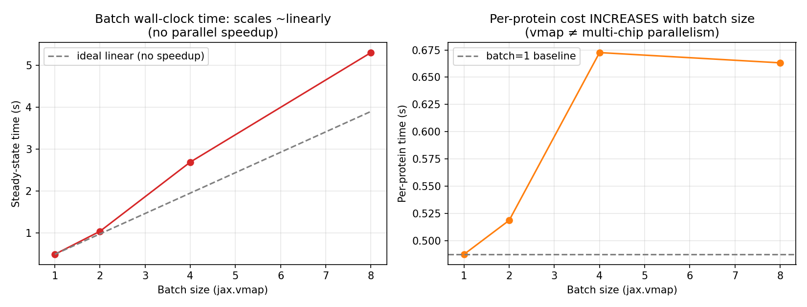

# Multi-Query Batching Experiment (jax.vmap, Stanford GKE TPU v5e-8 (2×4 lite))

## What this tests

Whether processing multiple independent proteins in a single compiled XLA
call (via `jax.vmap` over the model's `apply` function) gives real
throughput speedup versus running them one at a time.

## Implementation

A separate script, `src/spike_batch_forward_pass.py`, builds B independent
feature dicts (same sequence length, different sequences), stacks them
along a new leading axis, and wraps the existing single-query
`RunModel.apply` with `jax.vmap(apply, in_axes=(None, None, 0))`. `vmap`
adds a genuinely new batch dimension without touching the model's own
internal ensemble-dimension semantics.

## Results

| Batch size | steady-state (s) | proteins/sec | per-protein (s) | HBM (TPU_0) |
|---|---|---|---|---|
| 1 | 0.4875 | 2.051 | 0.4875 | 487 MB |
| 2 | 1.0374 | 1.928 | 0.5187 | 532 MB |
| 4 | 2.6905 | 1.487 | 0.6726 | 630 MB |
| 8 | 5.3053 | 1.508 | 0.6632 | 821 MB |

## Honest finding: batching made things worse, not better

Throughput (proteins/sec) **never exceeds** the batch=1 baseline, and
per-protein cost **increases** as batch size grows (0.49s to 0.66s). Total
wall-clock time scales almost exactly **linearly** with batch size, the
signature of *no* parallel speedup at all.

**Root cause, confirmed by the memory data:** across every batch size,
**only `TPU_0` ever shows nonzero HBM usage**; chips 1 through 7 stay at
0 MB regardless of batch size. `jax.vmap` vectorizes the computation
*within* a single chip's compiled program; it does not distribute work
across the TPU slice's 8 physical chips. Stacking more proteins into one
vmapped call just means one chip does more sequential-equivalent work,
with no chip-level parallelism to offset it.

## What this means, and what real multi-chip batching would require

This is a genuinely useful negative result, not a wasted experiment: it
demonstrates the concrete difference between **vectorization** (`vmap`,
same-chip, same-program, multiple data lanes) and **distributed
parallelism** (`pmap` or explicit `pjit`/mesh sharding, which place
different batch elements on *different* physical chips). Getting real
throughput scaling on this 8-chip slice requires rewriting the forward
pass with explicit device-mesh sharding, which `sweep/sharding.md` does
next.

**Hardware:** Stanford GKE TPU v5e-8 (`tpu-v5-lite-podslice`, topology 2×4, 8 chips) via Kubernetes Job + Kueue. AF2 baseline comparison also uses Google Colab Intel Xeon CPU (2 vCPU) and Google Colab NVIDIA Tesla T4 (`results/comparison.md`).
