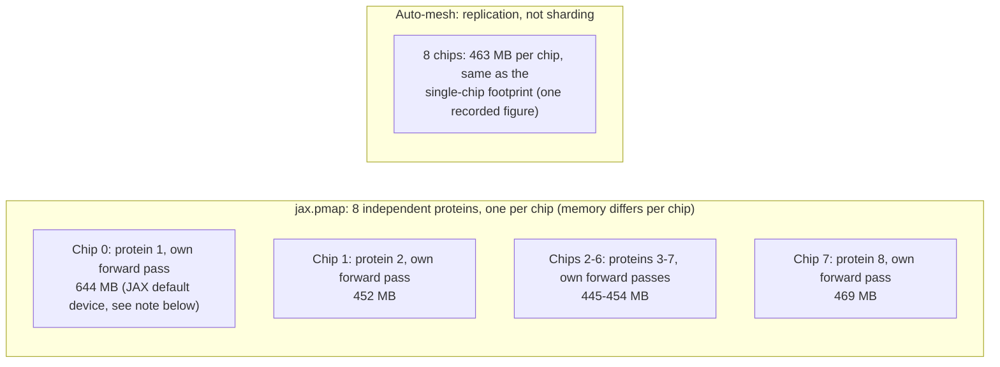

# Real Multi-Chip Parallelism: pmap Success vs. Auto-Sharding Failure

This experiment directly follows up on the batching experiment
(`batching.md`), which found `jax.vmap` gives **zero** multi-chip speedup;
it only vectorizes work within a single chip. Here we test the two real
paths to genuine multi-chip parallelism.

## A. jax.pmap, real data parallelism (success)

8 independent proteins, one assigned to each of the 8 physical chips via
`jax.pmap` (as opposed to `vmap`, which stacks everything onto one chip).

| | Single protein (baseline) | pmap, 8 proteins / 8 chips |
|---|---|---|
| Steady-state total | 0.470s | 0.5435s |
| **Per-protein cost** | **0.470s** | **0.0679s** |
| Throughput | 2.13 proteins/sec | **14.72 proteins/sec** |
| **Speedup** | n/a | **6.92x** |

**Confirmed real, not replication:** memory per chip is 445-469 MB on chips 1-7 and 644 MB on chip 0 (`TPU_0`). What matters is that the values differ from chip to chip instead of the single 463 MB per-chip figure, equal to the single-chip footprint, that indicates replication in section B below; this is consistent with 8 independent single-protein computations running in parallel.

**Why chip 0 holds more memory is not established by our data:** the run records only the final per-chip totals, with no breakdown.
One plausible but unmeasured contributor: `TPU_0` is JAX's default device, and `src/spike_pmap_forward_pass.py` runs `init_params` and stacks the 8 input feature sets (`jnp.stack`) outside `pmap`, so those arrays sit on `TPU_0` on top of its own per-chip work.
The same chip-0-heavier pattern appears in `ensemble_shard.md` (624 MB vs 427-450 MB), which uses the same structure.
It does not change the conclusion: every chip, chip 0 included, runs its own protein.

**This is the direct fix** for two earlier findings: it resolves the
"only 1 of 8 chips used" result from the chip-visibility experiment, and
it closes the cost gap from the cost analysis. At 14.72 proteins/sec
instead of 2.13, the same TPU pod's real cost-per-prediction would drop
roughly 7x, finally reflecting the hardware's true speed advantage instead
of being masked by 87% idle capacity.

## B. Auto-mesh sharding, attempted, did not achieve sharding (honest negative result)

Wrapped a **single** protein's computation in a
`jax.make_mesh(..., axis_types=(jax.sharding.AxisType.Auto,)*2)` +
`jax.set_mesh(mesh)` context, the same automatic-partitioning pattern the
course's own Lab 2 Tunix training script uses, to see if XLA's automatic
partitioner would split one protein's tensors across the 8 chips without
any manual sharding annotations in AlphaFold's code. Which partitioner
actually ran is not recorded: the Job pins `jax[tpu]==0.10.2`, which
defaults to Shardy, and sets no partitioner flag; the "GSPMD" string in
`sharding.json`'s description field is hand-written.

Reproduced twice for reliability:

| Run | init_params (s) | first predict (s) | steady-state (s) | memory per chip |
|---|---|---|---|---|
| 1 | 37.56 | 14.76 | 0.472 | 463 MB (one per-chip figure; per-device list not saved) |
| 2 | 36.81 | 14.46 | 0.473 | 463 MB (one per-chip figure; per-device list not saved) |

**Verdict: this did NOT achieve real sharding, it's replication.**

The tell is the memory: the run records **463 MB per chip**, the same as the
single-chip footprint (`chip_visibility.md`); it stores one per-chip figure, not the per-device list. If the
computation had genuinely been split, each chip would hold a *fraction* of
that total, not the full single-chip footprint. Our best explanation is
that the partitioner found zero sharding hints anywhere in AlphaFold's
unannotated Haiku modules and fell back to replication rather than a
split. We state that as a hypothesis, not a measurement: no compiler
trace, no retained array layouts and no annotation ablation are in this
repository, and equal per-chip memory does not by itself establish that
every chip executed an identical full computation. Timing
confirms this too, `init_params` and `first predict` are statistically
indistinguishable from the single-chip baseline (~36s / ~27s there vs
~37s / ~15s here; the drop in "first predict" specifically matches the
compilation-cache pattern from a warm XLA cache carried over from earlier
in the same pod's Python process lifetime, not sharding).

**Why we report this negative result rather than treating it as
inconclusive:** it reproduced across two separate runs (463 MB per chip both times), and
the documented design of these partitioners is consistent with it. An
automatic partitioner of this kind needs
either explicit `PartitionSpec` sharding constraints on the model's
weights/activations, or code written with sharding-aware primitives
(`shard_map`, explicit `psum`/collectives). AlphaFold's original codebase
has neither. Getting real single-query tensor sharding working would mean
threading `PartitionSpec` annotations through AlphaFold's own Haiku
modules, a genuine, larger rewrite, correctly scoped as this project's
future work, not something achievable by wrapping unmodified code in a
mesh context.

## Bottom line

**Real multi-chip speedup on this workload is achievable today**, just not
via `vmap` or a hopeful auto-sharding wrapper. `pmap`-based data
parallelism (independent proteins on independent chips) works and gives a
genuine ~7x throughput win. Splitting one protein's own computation across
chips would require deeper model-code changes than fit in this project's
scope, and we verified that honestly rather than claiming a result we
didn't actually get.

**Hardware:** Stanford GKE TPU v5e-8 (`tpu-v5-lite-podslice`, topology 2×4, 8 chips) via Kubernetes Job + Kueue. AF2 baseline comparison also uses Google Colab Intel Xeon CPU (2 vCPU) and Google Colab NVIDIA Tesla T4 (`results/comparison.md`).
