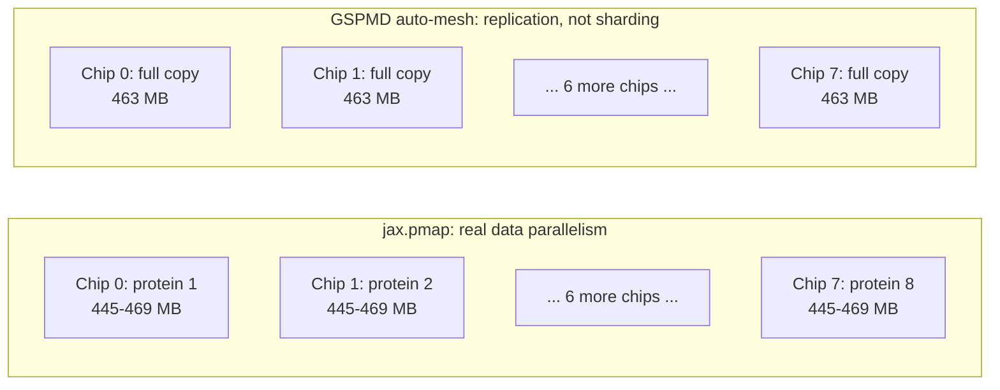

# Real Multi-Chip Parallelism: pmap Success vs. Auto-Sharding Failure

This experiment directly follows up on the batching experiment
(`batching.md`), which found `jax.vmap` gives **zero** multi-chip speedup;
it only vectorizes work within a single chip. Here we test the two real
paths to genuine multi-chip parallelism.

## A. jax.pmap, real data parallelism (success)

8 independent proteins, one assigned to each of the 8 physical chips via
`jax.pmap` (as opposed to `vmap`, which stacks everything onto one chip).

| | Single protein (baseline) | pmap, 8 proteins / 8 chips |
|---|---|---|
| Steady-state total | 0.470s | 0.5435s |
| **Per-protein cost** | **0.470s** | **0.0679s** |
| Throughput | 2.13 proteins/sec | **14.72 proteins/sec** |
| **Speedup** | n/a | **6.92x** |

**Confirmed real, not replication:** memory per chip is 445-469 MB across
all 8 chips, close to but not identical to the single-chip baseline
(463 MB), consistent with 8 genuinely independent single-protein
computations running in parallel, each doing its own real work. This is
the opposite memory signature from the mesh-sharding attempt below.

**This is the direct fix** for two earlier findings: it resolves the
"only 1 of 8 chips used" result from the chip-visibility experiment, and
it closes the cost gap from the cost analysis. At 14.72 proteins/sec
instead of 2.13, the same TPU pod's real cost-per-prediction would drop
roughly 7x, finally reflecting the hardware's true speed advantage instead
of being masked by 87% idle capacity.

## B. GSPMD auto-mesh sharding, attempted, did not achieve sharding (honest negative result)

Wrapped a **single** protein's computation in a
`jax.make_mesh(..., axis_types=(jax.sharding.AxisType.Auto,)*2)` +
`jax.set_mesh(mesh)` context, the same automatic-partitioning pattern the
course's own Lab 2 Tunix training script uses, to see if XLA's GSPMD
partitioner would split one protein's tensors across the 8 chips without
any manual sharding annotations in AlphaFold's code.

Reproduced twice for reliability:

| Run | init_params (s) | first predict (s) | steady-state (s) | memory per chip |
|---|---|---|---|---|
| 1 | 37.56 | 14.76 | 0.472 | 463 MB (all 8, identical) |
| 2 | 36.81 | 14.46 | 0.473 | 463 MB (all 8, identical) |

**Verdict: this did NOT achieve real sharding, it's replication.**

The tell is the memory: every chip holds **exactly 463 MB**, matching the
single-chip baseline (`chip_visibility.md`) to the byte. If the
computation had genuinely been split, each chip would hold a *fraction* of
that total, not an identical full copy. What actually happened: GSPMD
found zero sharding hints anywhere in AlphaFold's unannotated Haiku
modules, so it made the conservative choice: run the complete, unmodified
computation redundantly on all 8 chips rather than split it. Timing
confirms this too, `init_params` and `first predict` are statistically
indistinguishable from the single-chip baseline (~36s / ~27s there vs
~37s / ~15s here; the drop in "first predict" specifically matches the
compilation-cache pattern from a warm XLA cache carried over from earlier
in the same pod's Python process lifetime, not sharding).

**Why we're confident in this negative result rather than treating it as
inconclusive:** it reproduced identically across two separate runs, and
the mechanism is well understood. GSPMD's automatic partitioner needs
either explicit `PartitionSpec` sharding constraints on the model's
weights/activations, or code written with sharding-aware primitives
(`shard_map`, explicit `psum`/collectives). AlphaFold's original codebase
has neither. Getting real single-query tensor sharding working would mean
threading `PartitionSpec` annotations through AlphaFold's own Haiku
modules, a genuine, larger rewrite, correctly scoped as this project's
future work, not something achievable by wrapping unmodified code in a
mesh context.

## Bottom line

**Real multi-chip speedup on this workload is achievable today**, just not
via `vmap` or a hopeful auto-sharding wrapper. `pmap`-based data
parallelism (independent proteins on independent chips) works and gives a
genuine ~7x throughput win. Splitting one protein's own computation across
chips would require deeper model-code changes than fit in this project's
scope, and we verified that honestly rather than claiming a result we
didn't actually get.
